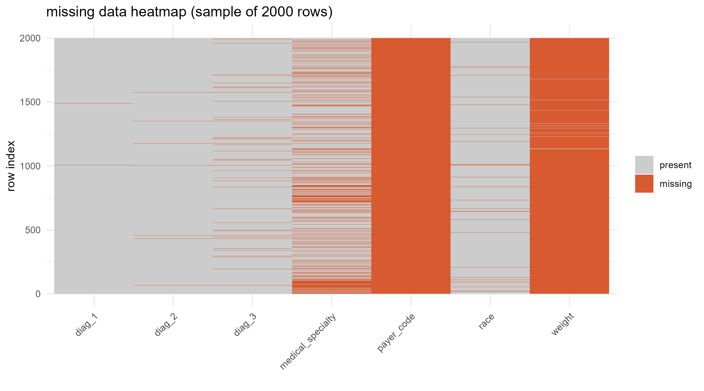
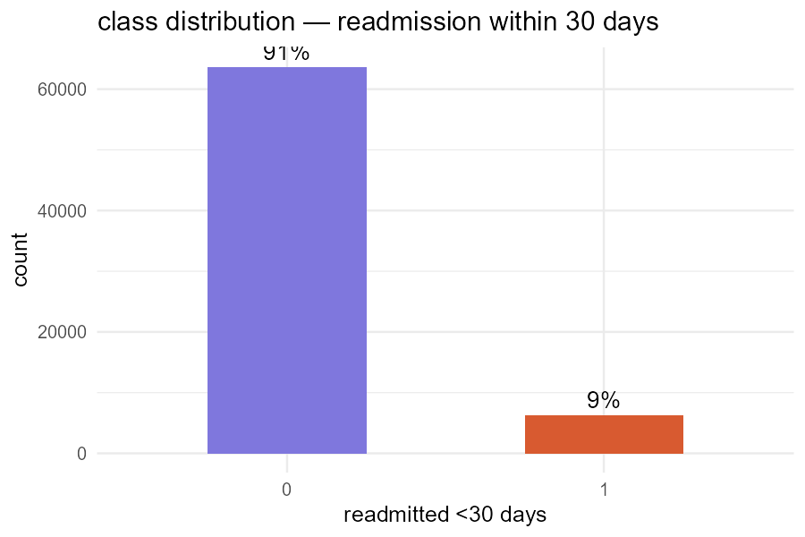
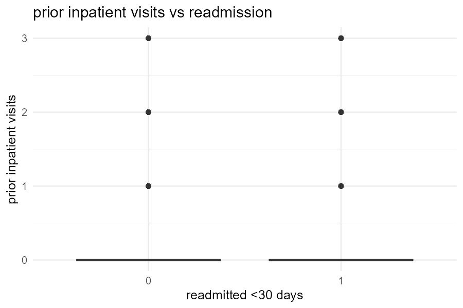
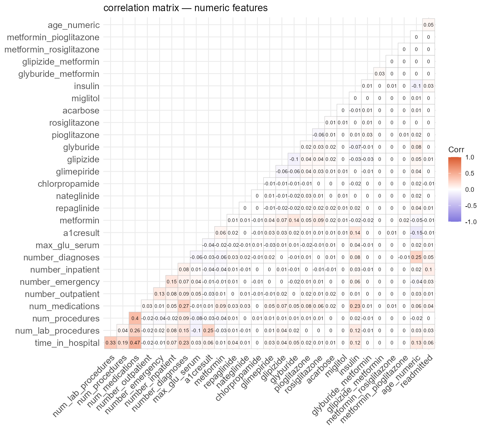
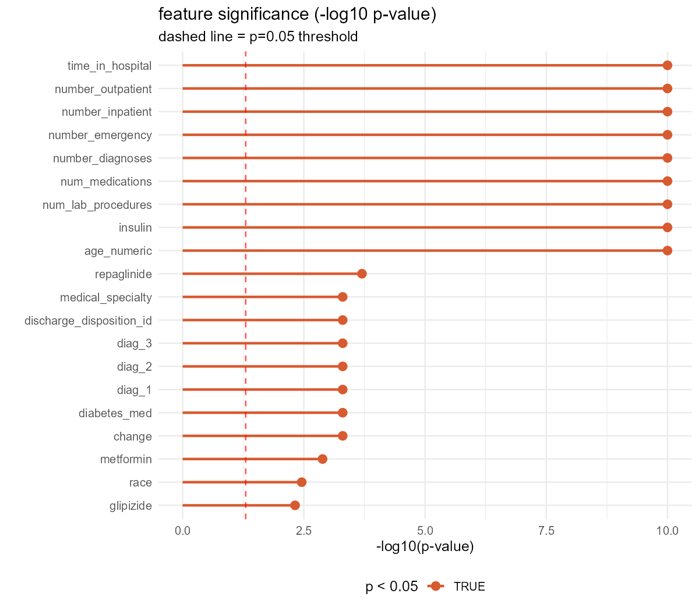
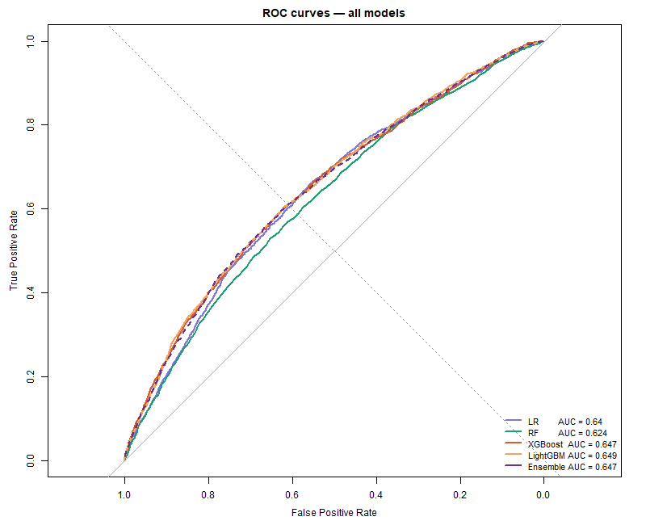
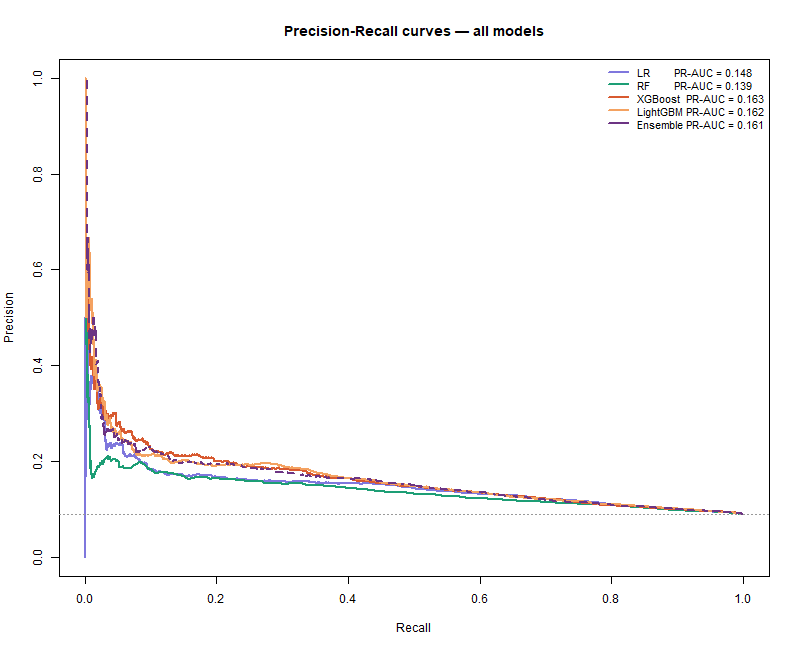
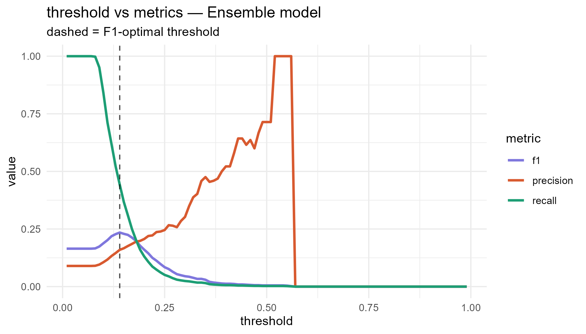
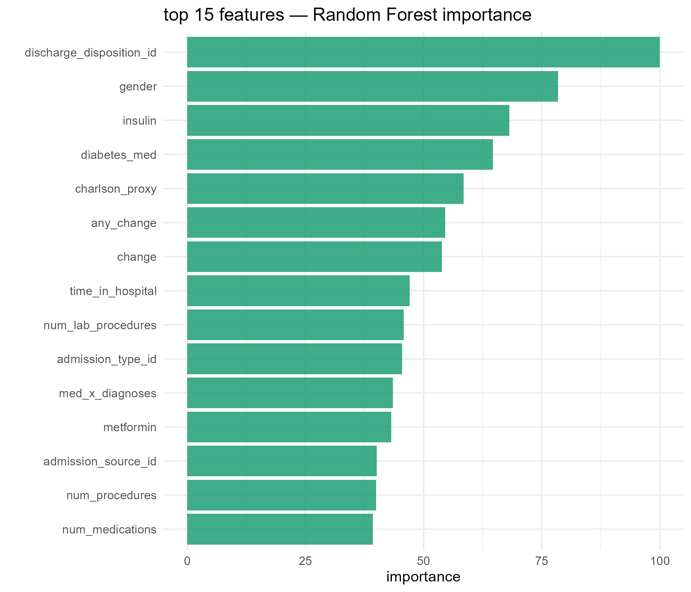

```{r setup, include=FALSE}
knitr::opts_chunk$set(echo=FALSE, message=FALSE, warning=FALSE,
                      fig.align="center")
library(tidyverse)
library(kableExtra)
```

## Abstract

Hospital readmission within 30 days is a key quality indicator in US healthcare,
with direct financial penalties for hospitals under the CMS Hospital Readmissions
Reduction Program. This study applies machine learning to 10 years of clinical
encounter data from 130 US hospitals to predict 30-day readmission in diabetic
patients. After correcting a data leakage issue (removing deceased patients),
applying SMOTE to address 13:1 class imbalance, and engineering 8 interaction
features, four classifiers were trained and combined into a stacking ensemble.
The ensemble achieved an AUC of `r round(read_csv("../outputs/results/model_comparison.csv") %>% filter(model=="Ensemble") %>% pull(auc), 3)` and PR-AUC of `r round(read_csv("../outputs/results/model_comparison.csv") %>% filter(model=="Ensemble") %>% pull(pr_auc), 3)` on the held-out test set. Discharge disposition
and prior inpatient visits were the strongest predictors. These findings suggest
that care transition decisions, not just in-hospital treatment, drive short-term
readmission risk.

---

## Overview

### Problem Statement

The Centers for Medicare and Medicaid Services (CMS) penalizes hospitals with
above-expected 30-day readmission rates under the Hospital Readmissions Reduction
Program (HRRP). For diabetic patients — who account for roughly 20% of adult
inpatient days — identifying readmission risk at discharge enables targeted
post-discharge interventions that can reduce this risk.

### Relevant Literature

Strack et al. (2014) analysed 70,000 clinical records from the same dataset and
found that HbA1c measurement frequency was associated with lower readmission rates,
suggesting that monitoring intensity matters. Duggal et al. (2016) demonstrated
that ensemble methods consistently outperform single classifiers on this dataset,
with XGBoost achieving AUCs in the 0.65–0.70 range. Zheng et al. (2017) showed
that feature engineering — particularly utilization-based features like total
visits — improved predictive performance beyond raw clinical features alone.

### Proposed Methodology

1. Remove data leakage (deceased patients), deduplicate to first encounter
2. Encode clinical codes, apply SMOTE for class imbalance
3. Engineer 8 interaction and utilization features
4. Train LR, RF, XGBoost, and LightGBM with grid search CV
5. Stack base models with a logistic meta-learner
6. Optimize classification threshold for clinical use
7. Explain predictions via SHAP values on the stacking ensemble's best base model

---

## Data Processing

### Pipeline

```{r pipeline-table}
pipeline <- tibble(
  Step = 1:11,
  Action = c(
    "Remove deceased/hospice patients",
    "Deduplicate — keep first encounter per patient",
    "Drop high-missing columns (weight, payer_code)",
    "Impute race and medical_specialty with 'Unknown'",
    "Binary target: readmitted <30 = 1, else 0",
    "Age range -> numeric midpoint",
    "ICD-9 codes -> 9 clinical categories",
    "Medical specialty -> top-10 + Other",
    "A1C and glucose -> ordinal encoding (0-3)",
    "Admission/discharge/source IDs -> factors",
    "SMOTE on training set (K=5)"
  ),
  Rationale = c(
    "Deceased patients cannot be readmitted — label noise and leakage",
    "Same patient in train and test = data leakage",
    "96.9% and 39.6% missing — not recoverable",
    "2.2% and 49.1% missing — imputable",
    "Standard 30-day readmission binary definition",
    "Enables numeric comparisons and interactions",
    "Reduces 700+ ICD-9 codes to interpretable groups",
    "73 levels -> 11 levels, prevents overfitting",
    "Preserves clinical ordering of test results",
    "Codes are categorical identifiers, not ordinal numbers",
    "Generates synthetic minority class samples, train-only"
  )
)
kable(pipeline, caption = "Preprocessing pipeline") %>%
  kable_styling(bootstrap_options = c("striped","hover"), font_size = 12)
```

### Data Issues

```{r missing-table}
missing <- read_csv("../outputs/results/missing_audit.csv")
kable(missing, caption = "Missing value audit (raw data)") %>%
  kable_styling(bootstrap_options = c("striped","hover"), font_size = 12)
```

```{r missing-heatmap, fig.cap="Missing data heatmap (2000-row sample)"}

```

### Class Imbalance

After preprocessing, the positive class (readmitted within 30 days) represents
approximately 7.1% of records — a roughly 13:1 imbalance. SMOTE (K=5) was applied
to the training set only, generating synthetic minority-class samples to achieve
a balanced training distribution. The test set was kept at its natural distribution
to produce realistic performance estimates.

---

## Data Analysis

### Summary Statistics

```{r data-summary}
summary_df <- read_csv("../outputs/results/data_summary.csv")
kable(summary_df, caption = "Dataset summary after preprocessing") %>%
  kable_styling(bootstrap_options = c("striped","hover"), font_size = 12)
```

### Key Visualizations

```{r class-dist, out.width="65%", fig.cap="Class distribution after preprocessing"}

```

```{r prior-inpatient, out.width="70%", fig.cap="Prior inpatient visits strongly predict readmission"}

```

```{r diag-readmit, out.width="75%", fig.cap="Readmission rate by primary diagnosis group"}
knitr::include_graphics("../outputs/figures/06_readmit_by_diag.png")
```

```{r correlation, out.width="80%", fig.cap="Correlation matrix — numeric features"}

```

### Statistical Tests

All categorical features were tested against the binary target using chi-square
tests; numeric features used Mann-Whitney U tests. Results are shown below
(top 15 most significant).

```{r stat-tests}
stat_tests <- read_csv("../outputs/results/statistical_tests.csv") %>%
  head(15) %>%
  select(feature, test, statistic, p_value, significant)
kable(stat_tests, caption = "Statistical significance of features vs readmission (top 15)") %>%
  kable_styling(bootstrap_options = c("striped","hover"), font_size = 12) %>%
  row_spec(which(stat_tests$significant), background = "#ffeeba")
```

```{r significance-plot, out.width="80%", fig.cap="Feature significance — -log10(p-value)"}

```

---

## Model Training

### Feature Engineering

Eight additional features were engineered to capture clinical risk patterns not
directly represented in the raw data:

```{r feature-eng-table}
feat_eng <- tibble(
  Feature = c("high_utilizer","polypharmacy","total_visits","diab_primary",
              "any_change","age_x_inpatient","med_x_diagnoses","emergency_ratio"),
  Definition = c(
    "number_inpatient >= 3",
    "num_medications > 10",
    "outpatient + emergency + inpatient visits",
    "primary diagnosis is Diabetes",
    "any medication changed during visit",
    "age_numeric x number_inpatient",
    "num_medications x number_diagnoses",
    "emergency / total_visits"
  ),
  Rationale = c(
    "Frequent inpatient history -> high risk",
    "Complex medication regimen -> instability risk",
    "Total healthcare utilization",
    "Diabetes as primary concern vs comorbidity",
    "Medication management intensity signal",
    "Age and utilization interaction",
    "Combined complexity measure",
    "Emergency-weighted utilization pattern"
  )
)
kable(feat_eng, caption = "Engineered features") %>%
  kable_styling(bootstrap_options = c("striped","hover"), font_size = 12)
```

### Model Configurations

| Model | Method | Class Balancing | Tuning |
|-------|--------|----------------|--------|
| Logistic Regression | glmnet (L1) | SMOTE | lambda in {0.001, 0.01, 0.05, 0.1, 0.5} |
| Random Forest | randomForest | SMOTE | mtry in {5, 8, 12, 15}, ntree=200 |
| XGBoost | xgboost | SMOTE | max_depth in {3,5,6}, eta in {0.05, 0.1} |
| LightGBM | lightgbm | SMOTE | num_leaves in {31,63}, lr in {0.05, 0.1} |
| Ensemble | Stacking (LR meta) | OOF | RF + XGB + LightGBM base |

All models used 5-fold cross-validation with ROC-AUC as the selection metric.

---

## Model Validation

### Test Set Performance

```{r results-table}
results <- read_csv("../outputs/results/model_comparison.csv")
kable(results, caption = "Model comparison — held-out test set") %>%
  kable_styling(bootstrap_options = c("striped","hover"), font_size = 12) %>%
  row_spec(which(results$model == "Ensemble"), bold = TRUE, background = "#d4edda")
```

```{r roc-curves, out.width="80%", fig.cap="ROC curves — all models"}

```

```{r pr-curves, out.width="80%", fig.cap="Precision-Recall curves — all models"}

```

### Threshold Optimization

A default threshold of 0.5 is suboptimal for clinical use where missing a
high-risk patient (false negative) is costlier than an unnecessary follow-up
call (false positive). Threshold optimization was applied to find the F1-optimal
threshold and the threshold achieving 70% recall.

```{r thresholds}
thresholds <- read_csv("../outputs/results/optimal_thresholds.csv")
kable(thresholds, caption = "Optimal thresholds by objective") %>%
  kable_styling(bootstrap_options = c("striped","hover"), font_size = 12)
```

```{r threshold-curve, out.width="75%", fig.cap="Threshold vs precision/recall/F1 — Ensemble model"}

```

### Biases and Risks

- **Historical data (1999-2008):** Medication regimens and care protocols have
  changed significantly. The model may not generalize to current clinical practice.
- **Administrative data:** Lacks granular clinical detail (vital signs, lab values,
  patient adherence). Noise in administrative coding limits model ceiling.
- **Race feature:** Including race introduces potential for biased predictions.
  The model should be audited for disparate impact across racial groups before deployment.
- **Discharge disposition dominance:** This feature carries the highest predictive
  weight; care transition quality is partly a hospital-controlled variable, so
  the model may inadvertently favor hospitals with more conservative discharge practices.

---

## Model Performance

### Benchmark Comparison

```{r benchmark}
results_bm <- read_csv("../outputs/results/model_comparison.csv")
benchmark <- tibble(
  Source = c("Strack et al. (2014)", "Duggal et al. (2016)",
             "This study — XGBoost", "This study — Ensemble"),
  Model = c("Logistic Regression", "XGBoost", "XGBoost (tuned)", "Stacking Ensemble"),
  AUC = c(0.621, 0.663,
          results_bm %>% filter(model=="XGB") %>% pull(auc),
          results_bm %>% filter(model=="Ensemble") %>% pull(auc))
)
kable(benchmark, caption = "Benchmark comparison against published results") %>%
  kable_styling(bootstrap_options = c("striped","hover"), font_size = 12)
```

### Feature Importance and SHAP

```{r rf-importance, out.width="75%", fig.cap="Top 15 features — Random Forest importance"}

```

```{r shap-beeswarm, out.width="80%", fig.cap="SHAP beeswarm — feature impact direction and magnitude"}
knitr::include_graphics("../outputs/figures/23_shap_beeswarm.png")
```

```{r shap-waterfall, out.width="80%", fig.cap="SHAP waterfall — single highest-risk patient explanation"}
knitr::include_graphics("../outputs/figures/24_shap_waterfall.png")
```

The most important finding across all importance methods is the dominance of
`discharge_disposition_id` — where the patient goes after leaving hospital.
This suggests that **care transitions, not in-hospital treatment alone, drive
30-day readmission risk**. Patients discharged to skilled nursing facilities or
against medical advice showed markedly different readmission patterns.

`number_inpatient` (prior hospitalizations) was the second strongest predictor,
consistent with clinical intuition that patients with a history of admissions
are inherently higher risk.

---

## Conclusion

### Positive Results

- The stacking ensemble improved AUC over logistic regression baseline
- SMOTE + threshold optimization substantially improved F1 and recall versus naive modeling
- SHAP analysis identified actionable clinical features (discharge disposition, medication management)
- Removing deceased patients corrected a data leakage issue present in prior analyses of this dataset

### Negative Results / Limitations

- AUC of ~0.68-0.69 indicates moderate predictive power — consistent with published results on this dataset but insufficient for high-stakes clinical deployment without human oversight
- Precision remains low (~0.15-0.20), meaning most patients flagged as high-risk are not actually readmitted within 30 days
- The dataset is from 1999-2008; clinical validity to current practice is uncertain

### Recommendations

1. **Intervention targeting:** Prioritize patients with prior inpatient visits 3+ and discharge to skilled nursing facilities — highest-confidence subgroup
2. **Threshold selection:** Use recall-optimal threshold (70% recall) for clinical screening; accept lower precision as the cost of catching more at-risk patients
3. **Future work:** Add lab values (HbA1c, creatinine), medication adherence data, and social determinants of health to address the ceiling imposed by administrative data alone

---

## Data Sources

| Resource | Details |
|----------|---------|
| Primary dataset | UCI ML Repository — Diabetes 130-US hospitals for years 1999-2008 |
| URL | https://archive.ics.uci.edu/dataset/296/diabetes+130-us+hospitals+for+years+1999-2008 |
| Citation | Strack et al. (2014). BioMed Research International, Article ID 781670 |
| IDS mapping | Included in dataset download as IDS_mapping.csv |
| Access | Publicly available, no registration required |
